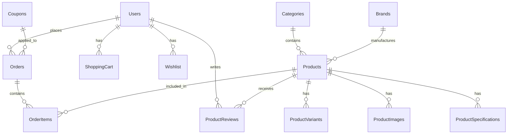

# System Patterns - E-Commerce Architecture

## 🏗️ Architecture Overview

### Clean Architecture Implementation
```
┌─────────────────────────────────────────────────────────┐
│                    PRESENTATION LAYER                   │
│  ┌─────────────┐  ┌─────────────┐  ┌─────────────┐      │
│  │   Web API   │  │  Admin Web  │  │ Mobile App  │      │
│  │  (ASP.NET)  │  │   (React)   │  │  (React)    │      │
│  └─────────────┘  └─────────────┘  └─────────────┘      │
└─────────────────────────────────────────────────────────┘
                              │
┌─────────────────────────────────────────────────────────┐
│                  APPLICATION LAYER                      │
│  ┌─────────────┐  ┌─────────────┐  ┌─────────────┐      │
│  │   Services  │  │  Handlers   │  │ Validators  │      │
│  │   (DTOs ✅) │  │ (Pending)   │  │ (Pending)   │      │
│  └─────────────┘  └─────────────┘  └─────────────┘      │
└─────────────────────────────────────────────────────────┘
                              │
┌─────────────────────────────────────────────────────────┐
│                    DOMAIN LAYER                         │
│  ┌─────────────┐  ┌─────────────┐  ┌─────────────┐      │
│  │  Entities   │  │  Interfaces │  │  Enums      │      │
│  │   (✅)      │  │   (✅)      │  │   (✅)      │      │
│  └─────────────┘  └─────────────┘  └─────────────┘      │
└─────────────────────────────────────────────────────────┘
                              │
┌─────────────────────────────────────────────────────────┐
│                INFRASTRUCTURE LAYER                     │
│  ┌─────────────┐  ┌─────────────┐  ┌─────────────┐      │
│  │  Database   │  │   External  │  │   File      │      │
│  │ (SQL Server)│  │   APIs      │  │  Storage    │      │
│  └─────────────┘  └─────────────┘  └─────────────┘      │
└─────────────────────────────────────────────────────────┘
```

## 📁 Project Structure Patterns

### Backend Solution Structure
```
Backend/EndProject/
├── DemoApp.Api/              # Presentation Layer
│   ├── Controllers/          # REST API endpoints
│   ├── Middleware/           # Custom middleware
│   ├── Program.cs            # Application startup
│   └── appsettings.json      # Configuration
├── DemoApp.Application/       # Application Layer 🔄
│   ├── DTOs/                # ✅ Data Transfer Objects
│   │   ├── Products/        # ✅ ProductDto, CreateProductDto, UpdateProductDto
│   │   ├── Users/           # ✅ UserDto, CreateUserDto, UpdateUserDto
│   │   ├── Categories/      # ✅ CategoryDto, CreateCategoryDto, UpdateCategoryDto
│   │   └── Brands/          # ✅ BrandDto, CreateBrandDto, UpdateBrandDto
│   ├── Interfaces/           # ✅ Service contracts
│   │   ├── IProductService.cs
│   │   ├── IUserService.cs
│   │   └── IAuthenticationService.cs
│   ├── Services/             # 🔄 Business logic services (pending)
│   ├── Mapping/              # ✅ AutoMapper profile
│   └── Validators/           # 🔄 FluentValidation (pending)
├── DemoApp.Domain/           # Domain Layer ✅
│   ├── Entities/             # ✅ Domain entities
│   ├── Enums/                # ✅ Domain enums
│   └── Interfaces/           # ✅ Repository contracts
├── DemoApp.Infrastructure/   # External services
│   ├── ExternalAPIs/         # Third-party integrations
│   ├── FileStorage/          # File handling
│   └── EmailService/         # Email notifications
└── DemoApp.Persistence/      # Data Access Layer ✅
    ├── Data/                 # ✅ DbContext
    ├── Repositories/         # ✅ Repository implementations
    └── UnitOfWork/           # ✅ Unit of Work pattern
```

## 🔧 Design Patterns

### 1. Repository Pattern ✅
```csharp
// Interface (Domain Layer)
public interface IRepository<T> where T : class
{
    Task<T> GetByIdAsync(int id);
    Task<IEnumerable<T>> GetAllAsync();
    Task<T> AddAsync(T entity);
    Task UpdateAsync(T entity);
    Task DeleteAsync(T entity);
}

// Implementation (Persistence Layer)
public class Repository<T> : IRepository<T> where T : class
{
    private readonly ApplicationDbContext _context;
    private readonly DbSet<T> _dbSet;
    
    // Implementation details...
}
```

### 2. Unit of Work Pattern ✅
```csharp
public interface IUnitOfWork : IDisposable
{
    IRepository<User> Users { get; }
    IRepository<Product> Products { get; }
    IRepository<Order> Orders { get; }
    // ... other repositories
    
    Task<int> SaveChangesAsync();
    Task BeginTransactionAsync();
    Task CommitTransactionAsync();
    Task RollbackTransactionAsync();
}
```

### 3. DTO Pattern ✅
```csharp
// Data Transfer Objects (Application Layer)
public class ProductDto
{
    public int ProductId { get; set; }
    public string ProductName { get; set; } = string.Empty;
    public decimal Price { get; set; }
    public string CategoryName { get; set; } = string.Empty;
    public string BrandName { get; set; } = string.Empty;
    // ... other properties
}

public class CreateProductDto
{
    [Required]
    [StringLength(200)]
    public string ProductName { get; set; } = string.Empty;
    
    [Required]
    [Range(0.01, double.MaxValue)]
    public decimal Price { get; set; }
    // ... other properties with validation
}
```

### 4. Service Interface Pattern ✅
```csharp
public interface IProductService
{
    Task<IEnumerable<ProductDto>> GetAllProductsAsync();
    Task<ProductDto?> GetProductByIdAsync(int id);
    Task<ProductDto> CreateProductAsync(CreateProductDto createProductDto);
    Task<ProductDto> UpdateProductAsync(int id, UpdateProductDto updateProductDto);
    Task<bool> DeleteProductAsync(int id);
}
```

### 5. AutoMapper Pattern ✅
```csharp
public class AutoMapperProfile : Profile
{
    public AutoMapperProfile()
    {
        // Entity to DTO mapping
        CreateMap<Product, ProductDto>()
            .ForMember(dest => dest.CategoryName, opt => opt.MapFrom(src => src.Category.CategoryName))
            .ForMember(dest => dest.BrandName, opt => opt.MapFrom(src => src.Brand.BrandName));
        
        // DTO to Entity mapping
        CreateMap<CreateProductDto, Product>();
        CreateMap<UpdateProductDto, Product>();
    }
}
```

### 6. CQRS Pattern (Planned)
```csharp
// Commands
public interface ICommandHandler<TCommand> where TCommand : ICommand
{
    Task<Result> HandleAsync(TCommand command);
}

// Queries
public interface IQueryHandler<TQuery, TResult> where TQuery : IQuery<TResult>
{
    Task<TResult> HandleAsync(TQuery query);
}
```

### 7. Mediator Pattern (Planned)
```csharp
public interface IMediator
{
    Task<TResponse> Send<TResponse>(IRequest<TResponse> request);
    Task Publish<TNotification>(TNotification notification);
}
```

## 🗄️ Database Patterns

### Entity Relationships


### Indexing Strategy
```sql
-- Primary Keys
CREATE CLUSTERED INDEX PK_Users ON Users(Id)
CREATE CLUSTERED INDEX PK_Products ON Products(Id)

-- Foreign Keys
CREATE INDEX IX_Products_CategoryId ON Products(CategoryId)
CREATE INDEX IX_Products_BrandId ON Products(BrandId)

-- Search Optimization
CREATE INDEX IX_Products_Name ON Products(Name)
CREATE INDEX IX_Products_Price ON Products(Price)

-- Composite Indexes
CREATE INDEX IX_Orders_UserId_Status ON Orders(UserId, Status)
CREATE INDEX IX_ProductVariants_ProductId_Color ON ProductVariants(ProductId, Color)
```

## 🔐 Security Patterns

### Authentication & Authorization
```csharp
// JWT Token Structure
public class JwtToken
{
    public string AccessToken { get; set; }
    public string RefreshToken { get; set; }
    public DateTime ExpiresAt { get; set; }
}

// Role-based Authorization
[Authorize(Roles = "Admin")]
public class AdminController : ControllerBase
{
    // Admin-only endpoints
}

// Policy-based Authorization
[Authorize(Policy = "CanManageProducts")]
public async Task<IActionResult> UpdateProduct(int id, UpdateProductDto dto)
{
    // Product management logic
}
```

### Input Validation
```csharp
// FluentValidation (Planned)
public class CreateProductValidator : AbstractValidator<CreateProductDto>
{
    public CreateProductValidator()
    {
        RuleFor(x => x.Name).NotEmpty().MaximumLength(200);
        RuleFor(x => x.Price).GreaterThan(0);
        RuleFor(x => x.CategoryId).GreaterThan(0);
    }
}
```

## 🚀 Performance Patterns

### Caching Strategy
```csharp
// Memory Cache
public class ProductService
{
    private readonly IMemoryCache _cache;
    
    public async Task<Product> GetProductAsync(int id)
    {
        var cacheKey = $"product_{id}";
        return await _cache.GetOrCreateAsync(cacheKey, async entry =>
        {
            entry.SlidingExpiration = TimeSpan.FromMinutes(10);
            return await _repository.GetByIdAsync(id);
        });
    }
}
```

### Pagination Pattern
```csharp
public class PaginatedResult<T>
{
    public IEnumerable<T> Items { get; set; }
    public int TotalCount { get; set; }
    public int PageNumber { get; set; }
    public int PageSize { get; set; }
    public int TotalPages { get; set; }
}
```

## 🔄 API Patterns

### RESTful Endpoints
```csharp
[ApiController]
[Route("api/[controller]")]
public class ProductsController : ControllerBase
{
    // GET /api/products
    [HttpGet]
    public async Task<ActionResult<PaginatedResult<ProductDto>>> GetProducts([FromQuery] ProductFilterDto filter)
    
    // GET /api/products/{id}
    [HttpGet("{id}")]
    public async Task<ActionResult<ProductDto>> GetProduct(int id)
    
    // POST /api/products
    [HttpPost]
    public async Task<ActionResult<ProductDto>> CreateProduct(CreateProductDto dto)
    
    // PUT /api/products/{id}
    [HttpPut("{id}")]
    public async Task<IActionResult> UpdateProduct(int id, UpdateProductDto dto)
    
    // DELETE /api/products/{id}
    [HttpDelete("{id}")]
    public async Task<IActionResult> DeleteProduct(int id)
}
```

### Response Patterns
```csharp
public class ApiResponse<T>
{
    public bool Success { get; set; }
    public string Message { get; set; }
    public T Data { get; set; }
    public List<string> Errors { get; set; }
}
```

## 🧪 Testing Patterns

### Unit Testing Structure
```csharp
public class ProductServiceTests
{
    private readonly Mock<IUnitOfWork> _mockUnitOfWork;
    private readonly Mock<IMapper> _mockMapper;
    private readonly ProductService _service;
    
    [Fact]
    public async Task GetProductById_ValidId_ReturnsProduct()
    {
        // Arrange
        var productId = 1;
        var expectedProduct = new Product { Id = productId, Name = "Test Product" };
        _mockUnitOfWork.Setup(x => x.Products.GetByIdAsync(productId))
                      .ReturnsAsync(expectedProduct);
        
        // Act
        var result = await _service.GetProductByIdAsync(productId);
        
        // Assert
        Assert.NotNull(result);
        Assert.Equal(expectedProduct.Name, result.Name);
    }
}
```

## 📊 Monitoring Patterns

### Logging Strategy
```csharp
public class LoggingBehavior<TRequest, TResponse> : IPipelineBehavior<TRequest, TResponse>
{
    private readonly ILogger<LoggingBehavior<TRequest, TResponse>> _logger;
    
    public async Task<TResponse> Handle(TRequest request, RequestHandlerDelegate<TResponse> next)
    {
        _logger.LogInformation("Handling {RequestName}", typeof(TRequest).Name);
        var response = await next();
        _logger.LogInformation("Handled {RequestName}", typeof(TRequest).Name);
        return response;
    }
}
```

### Health Checks
```csharp
public class Startup
{
    public void ConfigureServices(IServiceCollection services)
    {
        services.AddHealthChecks()
                .AddDbContextCheck<ApplicationDbContext>()
                .AddCheck<ExternalApiHealthCheck>("External API");
    }
}
```

## 🎯 Key Technical Decisions

1. **Clean Architecture**: Strict separation of concerns
2. **Entity Framework Core**: ORM for data access
3. **Repository Pattern**: Abstraction over data access
4. **Unit of Work**: Transaction management
5. **DTO Pattern**: Data transfer objects for API layer
6. **AutoMapper**: Entity-to-DTO mapping
7. **JWT Authentication**: Stateless authentication
8. **Swagger Documentation**: API documentation
9. **CORS Policy**: Cross-origin resource sharing
10. **Dependency Injection**: IoC container usage

## 📊 Current Implementation Status

### ✅ Completed Patterns
- **Repository Pattern**: Generic repository implementation
- **Unit of Work Pattern**: Transaction management
- **DTO Pattern**: Data transfer objects for all entities
- **Service Interface Pattern**: Contract definitions
- **AutoMapper Pattern**: Entity-to-DTO mapping
- **Database Patterns**: Entity relationships and indexing

### 🔄 Pending Patterns
- **Service Implementation Pattern**: Business logic services
- **Validation Pattern**: FluentValidation rules
- **CQRS Pattern**: Command/Query separation
- **Mediator Pattern**: Request/Response handling
- **Caching Pattern**: Memory and distributed caching
- **Testing Pattern**: Unit and integration tests

These patterns ensure maintainable, scalable, and testable code while following industry best practices for e-commerce applications.
